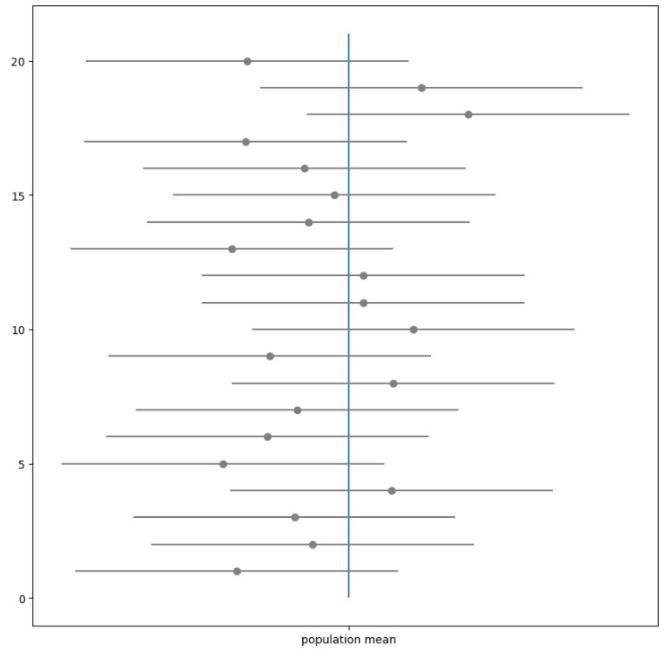
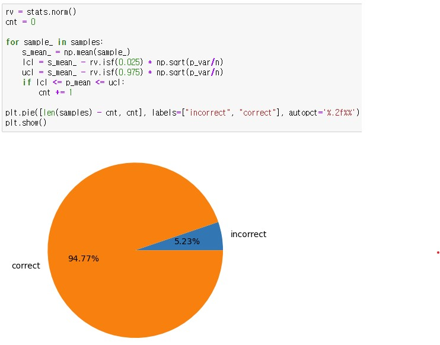

# 2023-06-16

## 통계적 추정

### 점추정

* 불편성 (unbiasedness) as maybe 비편향성
    * 추정량의 기댓값이 추측하려는 모수가 되는 성질
    * 기댓값이 추측하고 싶은 모수가 되는 성질
* 불편추정량 (unbiased estimator)
    * 불편성을 가진 추정량
* 일치성 (consistency)
    * 표본 크기 n을 증가시키면 원하는 모수에 수렴해가는 성질
    * 표본 크기를 키우면 추측하고 싶은 모수에 수렴하는 성질
* 일치추정량 (consistent estimator)
    * 일치성을 지닌 추정량
    * 표본평균은 일치추정량이다.
* 유효성 (efficiency)
    * 불편추정량 중에서도 분산이 최소가 되는 추정량이 지닌 성질

### 모분산의 점추정

* 불편분산 (unbiased variance)
    * 표본분산에서 나누는 수 n을 n-1로 한다.
    * n - 1은 자유도이다.
* 자유도(degree of freedom)
    * 통계적 추정을 할 때 표본자료 중 모집단에 대한 정보를 주는 독립적인 자료의 수
* ddof (Delta Degrees Of Freedom)
    * 본래 자유도 n과의 차이

### 결론
* 표본평균과 불편분산은 각각 모평균과 모분산에 대해 불편성과 일치성을 지닌 추정량이 된다.

 

## 구간 추정

### 정규분포의 모평균 구간추정 (모분산을 알고 있는 경우)

* 표준 오차 (standard error)
    * 추정량의 표준 편차

