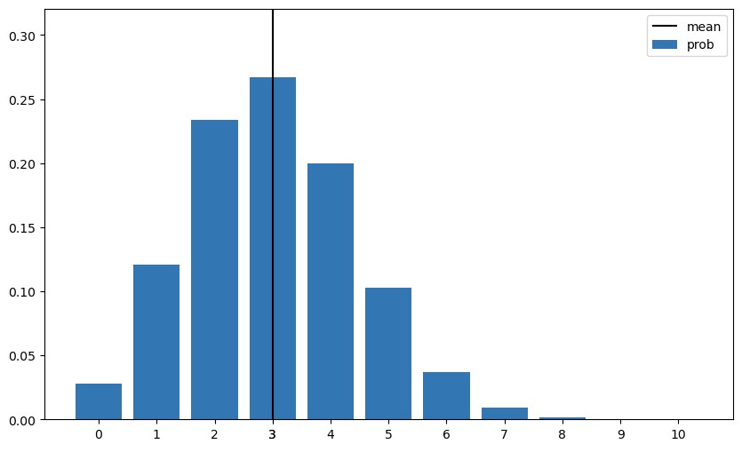
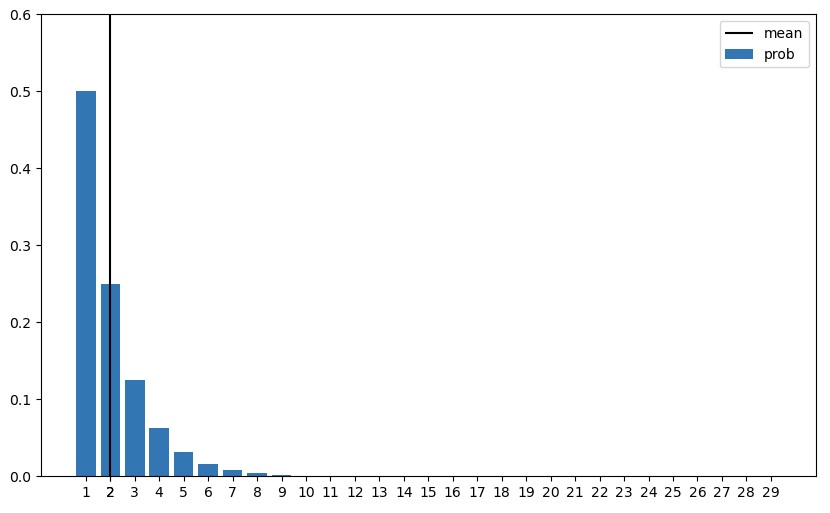
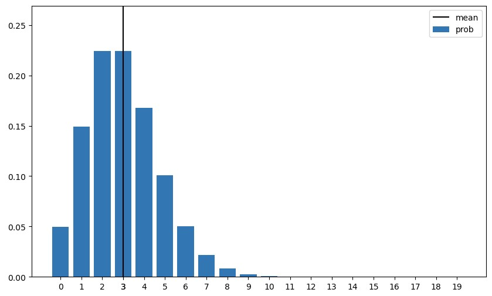
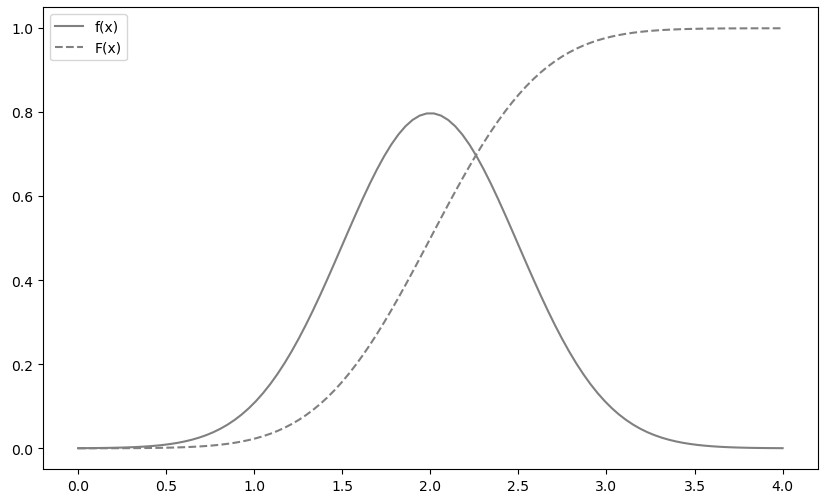

# 2023-06-09

## HTML
* query string
  * url ? 뒤에 붙는 쿼리 문자열
* get
  * 원래는 데이터를 얻고 싶을 때 사용
  * url에서 확인 가능
* post
  * 원래는 데이터를 저장시키고 싶을 때 사용
  * payload에서 확인 가능
* put
* delete
* restful

 

## 대표적인 이산형 확률분포

### 이항 분포(binomial distribution)

* 확률 함수에 콤비네이션(조합)을 사용한다.
* 성공확률이 p, 시행 횟수가 n일 때
  * E(X) = np
  * V(X) = np(1-p)

### 기하 분포(geometric distribution)
* 베르누이 시행에서 처음으로 성공할 때까지 반복한 시행 횟수가 따르는 분포
* 확률 함수 f(x) = (1-p)**(x-1)*p, x는 시행횟수(자연수)이다.
* 성공확률이 p일 때
  * E(X) = 1/p
  * V(X) = (1-p)/p**2

### 포아송 분포(Poisson distribution)
* 단위 시간 당 평균 λ번 사건이 발생할 때 x번 사건이 발생할 확률의 분포.
* f(x) = `λ**x / x! * e**-λ`
* E(X) = λ, V(X) = λ

 

## 연속형 확률변수

### 1차원 연속형 확률변수
연속형 확률변수에서 확률변수가 어떤 값을 취할 때의 확률을 정의하려고 한다면 어떤 경우에도 확률이 0이 된다.

#### **정의**
* 확률밀도함수(probability density function, PDF) as 밀도함수
  * 밀도함수는 확률함수에 가깝지만 동일하지는 않다.
  * 특정 한 점에 확률이 있는 것이 아니라, 구간을 적분해야 그것이 확률이 된다.
* 누적분포함수 as 분포함수
  * 확률변수 X가 x 이하가 될 때의 확률을 반환하는 함수 F(x)를 누적분포함수라 한다.
  * 단조증가함수이다.
* 단조증가함수
  * x가 증가할 때 y는 감소하지 않는 함수

#### **지표**
* 기댓값
  * E(X) = xf(x)의 전체 영역 적분
  * 선형성 성립
* 분산
  * 이산형 확률변수 계산방법에 적분 추가
  * 성질도 같다

### 2차원 연속형 확률변수

#### **정의**
* 결합확률밀도함수
  * 이중 적분이 확률함수가 된다.
  * 다른 확률함수와 마찬가지로 모든 확률 값은 0 이상이어야하고, 총합이 1이어야한다.
* 주변확률밀도함수
  * 확률변수 X만의 움직임(밀도함수)를 알고 싶을 때 x를 고정(선택)하고 적분한다.

#### **지표**
* 기댓값
  * E(X)은 x*f(x, y)를 이중적분한 값
  * 선형성이 성립
* 분산
  * V(X)도 거의 비슷한 방법이다. 값에 기댓값을 뺀 편차의 제곱을 확률로 곱한 것을 이중적분하면 된다.
* 공분산
  * 공분산 Cov(X, Y)도 마찬가지로 변수값에 기댓값을 뺀 값을 곱해서 확률로 곱해 이중적분한다.
* 상관계수
  * 상관계수도 표준편차 값을 곱한 값을 공분산에 나눠준 값이다.

 

## 대표적인 연속형 확률분포

* [matplotlib.axes._axes.Axes .plot(`<arguments>`)](https://matplotlib.org/stable/api/_as_gen/matplotlib.axes.Axes.plot.html)
  * ax.plot([1, 2, 3], [3, 4, 6]) 을 작성하면 (1, 3), (2, 4), (3, 6)를 연결하는 직선을 그려준다.
  * return type -> list[matplotlib.lines.Line2D]
### 정규분포(normal distribution)
* 가우스 분포(Gaussian distribution)라고도 부른다.
* 밀도함수는 평균과 분산으로 나타내며 수식은 복잡해서 지금부터 생략합니다.
* 기댓값과 분산은 수식의 평균과 분산과 같다.
* 정규분포를 따르는 확률변수 X를 aX + b와 같이 변환하는 경우
  * 변환한 확률분포도 정규분포를 따른다.
  * 기댓값은 a * E(X) + b, 분산은 a**2 * V(X) 이다.
* 표준정규분포(standard normal distribution)
  * N(μ, σ2)에서 정규화한 확률변수 Z = (X - μ) / σ는 N(0, 1)을 따른다.
  * 이러한 표준화한 정규분포 N(0, 1)을 표준정규분포라 부른다.

이하는 기댓값이 2, 표준편차가 0.5인 정규분포. N(2, 0.5)의 plot.

* from scipy.stats import norm
  * rv = norm(기댓값, 표준편차)
  * rv.mean()
    * 평균
  * rv.var()
    * 분산
  * rv.pdf(x)
    * 밀도함수
  * rv.cdf(x)
    * 분포함수
  * rv.isf(α)
    * 상위 100α%점
  * rv.interval(α)
    * 중간 100α% 구간

### 지수분포(exponential distribution)

---
await next_study(214)

