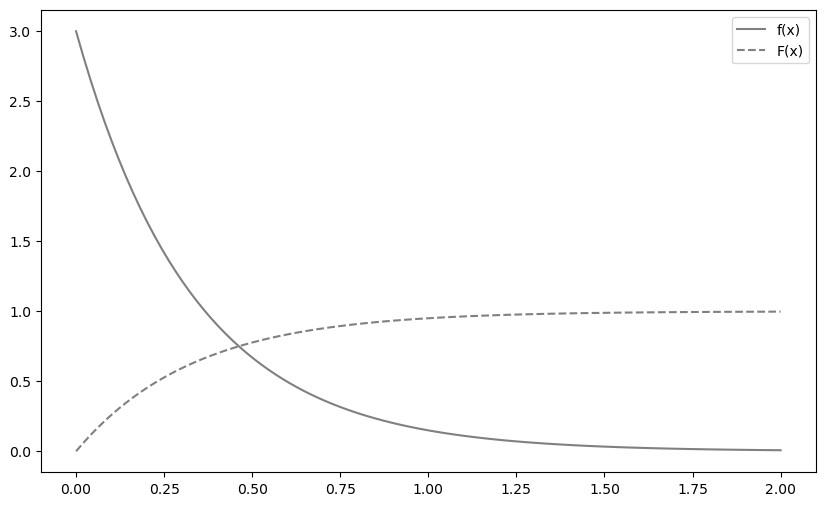
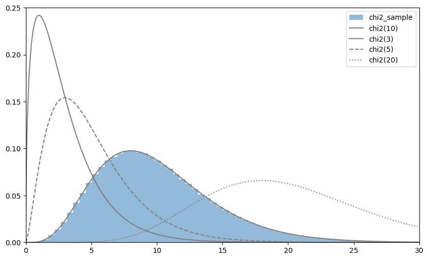
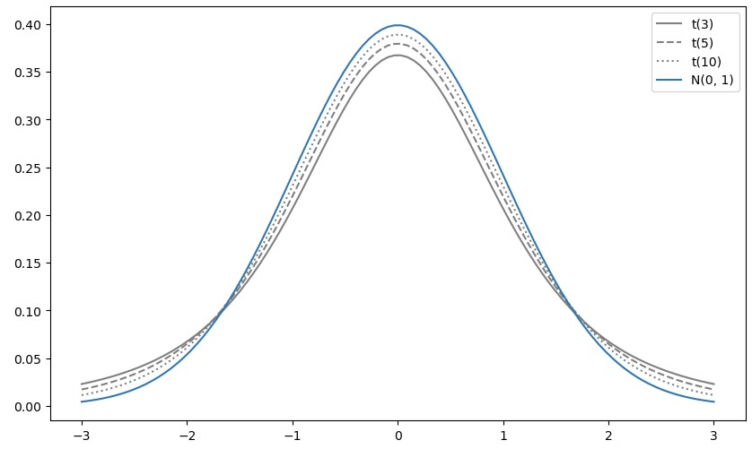
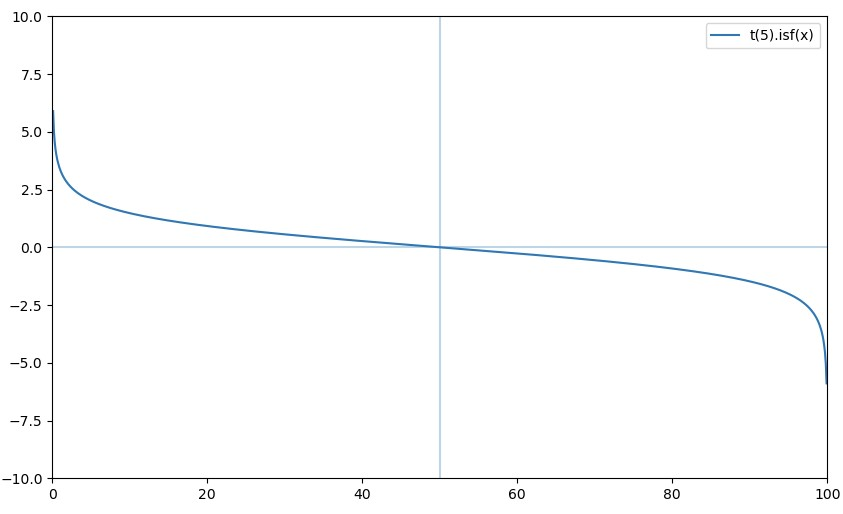
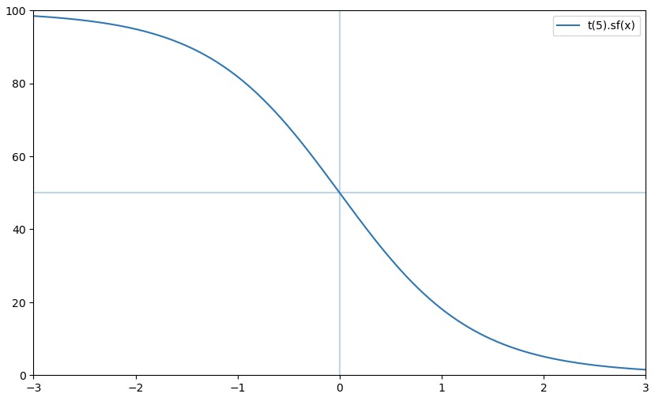
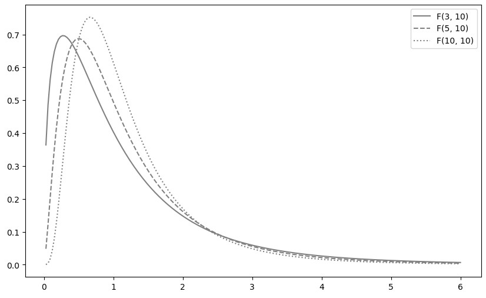

# 2023-06-14

## 대표적인 연속형 확률분포

* 용어
    * rvs(random variable sampling)
    * isf(inverse survival function)
    * cdf(cumulative distribution function)

### 지수분포(exponential distribution)

* 어떤 사건이 발생하는 간격이 따르는 분포
* 밀도함수 f(x) = λe**(-λx) (x >= 0)
* `scipy.stats.expon(scale=1/λ)`

### 카이제곱분포(chi-square distribution)

분산의 구간추정이나 독립성 검정에서 사용되는 확률 분포.
* 추정과 검정에 사용하는 특수한 확률분포.
* 어떠한 형태를 하고 있다. 라고 설명한다.
* 정규분포와의 관련성을 중점으로 보자.
* 감마 분포의 특수한 형태이다.
* 서로 독립인 복수의 표준정규분포에 의해 다음과 같이 정의한다.
    * `Y = sum([Z**2 for Z in Z_set])`
* 표준정규분포 개수 n을 자유도 n이라 한다.
* 특징
  * 좌우비대칭으로, 왼쪽으로 치우치고 오른쪽으로 넓어진다.
  * 자유도가 커지면 좌우대칭에 가까워진다.
  * 자유도의 값 가까이에 분포의 정점이 있다.

### t 분포(t distribution)

정규분포에서 모평균의 구간추정 등에 사용하는 확률분포이다.

* 서로 독립인 표준정규분포와 카이제곱분포에 의해 다음과 같이 정의한다.
    * 확률 변수 Z(표준정규분포), Y(자유도 n인 카이제곱분포)
    * `t = Z / math.sqrt(Y / n)`
    * 를 자유도가 n인 t분포라고 한다.
* 특징
    * 좌우대칭인 분포
    * 표준정규분포보다 양쪽 끝이 두껍다.
    * 자유도가 커지면 표준정규분포에 가까워진다.

### F 분포(F distribution)

분산분석 등에서 사용되는 확률분포

* 서로 독립인 두 개의 카이제곱분포에 의해 정의
    * `F = (Y1/n1) / (Y2/n2)`
    * 자유도가 n1, n2인 F분포 F(n1, n2)라고 한다.
* 좌우비대칭으로, 왼쪽으로 치우치고 오른쪽으로 넓어지는 분포
* 분포의 정점은 1에 가깝다.
    

 

## 독립동일분포

서로 독립인 다차원 확률변수를 살펴보자.

* 서로 독립
    * 확률변수가 다른 확률변수에 영향을 끼치지 않는다는 의미

### 독립성
await study(234)
