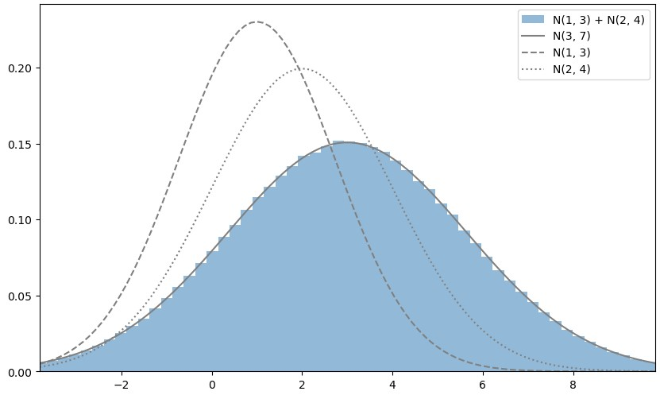
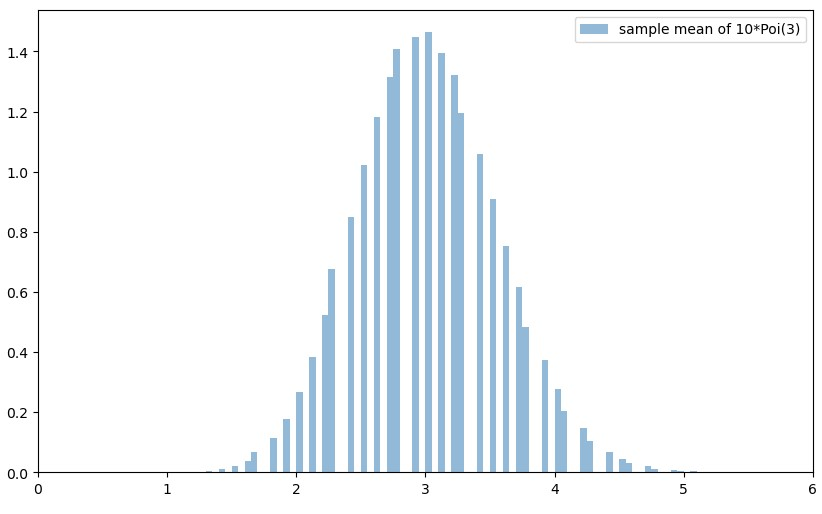
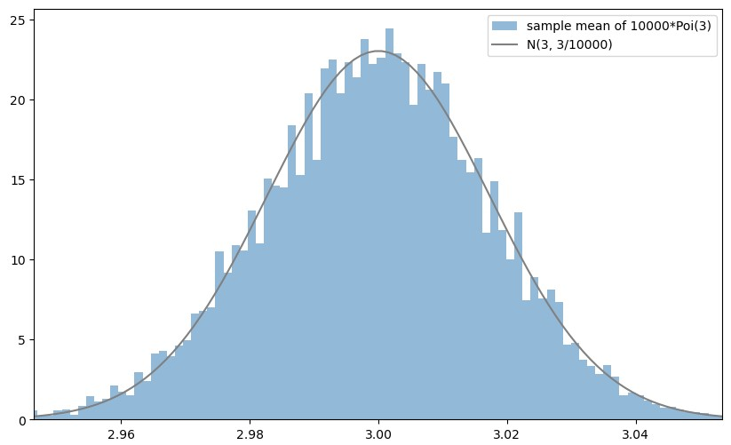
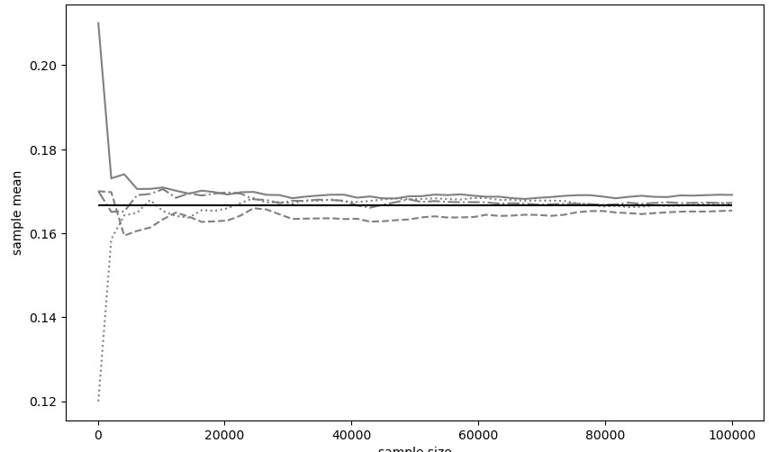

# 2023-06-15

## 독립동일분포 (independently and indentically distributed, i.i.d.)

* 서로 독립이고 각각 동일한 확률분포를 따르는 다차원 확률변수
* 동일한 조건 아래에서 수행되는 실험이나 관측을 여러 번 반복하여 데이터를 얻는 것을 수학 용어로 나타낸 것

### 독립성 (independence)

* fX, Y(x, y) = fX(x)fY(y)
* f(...) = f(x)f(y)...f(z)
* 무상관
    * 공분산이나 상관계수가 0인 경우
    * 독립일 때 무상관이지만, 무상관이라고 독립인 것은 아니다.

### 합의 분포

* 합의 분포 기댓값은 각 확률변수 기댓값의 합으로 계산할 수 있다.
* 확률 변수가 서로 독립이라면 확률변수 합의 분산을 각 확률변수 분산의 합으로 계산할 수 있다.
* 재생성 (reproductive property)
    * 동일한 분포를 따르는 2개의 독립인 확률변수에 대해서, 그 합도 동일한 확률분포
    * 모든 확률분포가 재생성을 갖는 것은 아니다.

#### 정규 분포의 합의 분포

* 재생성이 있다
* 합의 분포의 기댓값과 분산이 각각의 기댓값과 분산을 합한 값과 같아 N(sum(...), sum(...))이 된다.

#### 포아송 분포의 합의 분포

* 재생성이 있다
* Poi(sum(...)) 확률 분포가 된다.

#### 베르누이 분포의 합의 분포

* 재생성이 없다
* 이항분포의 형태가 된다. Bin(n, p)

### 표본평균의 분포

서로 독립이고 동일한 확률분포를 따르는 확률변수의 표본 평균이 따르는 분포이다.

* 표본평균의 분포의 기댓값과 분산
    * 기댓값은 같고, 분산은 n으로 나눈 값이 된다.

#### 정규분포의 표본평균 분포

* N(기댓값, 분산 / n)과 같다.

#### 포아송 분포의 표본평균 분포

### **중심극한 정리 (central limit theorem)**

**★ 확률 변수가 서로 독립이고 기댓값이 μ, 분산이 σ2인 확률분포 F를 따를 때, 
n이 커짐에 따라 표본평균의 분포는 정규분포 $N(μ, \frac{σ^2}{n})$에 가까워진다. ★**

### **대수의 법칙 (law of large numbers)**

**표본 크기를 키우면 표본평균은 모평균에 수렴한다고 주장하는 정리.**

 

## 통계적 추정

* 점추정
    * 추정하고 싶은 모평균이나 모분산이라는 모수를 하나의 수치로 추정하는 방법
* 구간추정
    * 폭(구간)으로 모수를 추정하는 방법

await study(263)

 
 

## 알고리즘

### 동적 계획법

* 메모이제이션 (Memoization) as 캐싱 (Caching)
    * 한 번 계산한 결과를 메모리 공간에 메모하는 기법
    * 탑 다운 방식
    * 결과 저장용 리스트를 DP 테이블이라고 부른다.
* 분할 정복과의 차이점은 부분 문제의 중복이다. (독립이 아니다.)
* 그리디, 구현, 완전 탐색으로 문제가 해결이 안 되면 DP를 고려해보자.
* 재귀로 완전 탐색 프로그램을 작성할 수 있을 때 작은 문제에서 구한 답이 큰 문제에서 그대로 사용될 수 있다면 DP로 개선할 수 있다.
