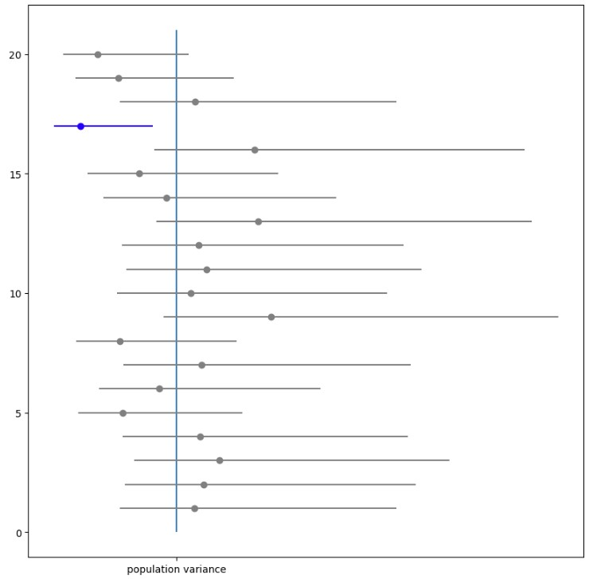

# 2023-06-19

## 통계적 추정

### 정규분포의 모분산 구간추정

### 정규분포의 모평균 구간추정 (모분산을 알지 못할 때)
모분산대신 불편분산을 사용한 표준오차를 사용한다.
그렇게 되면 t 분포를 따르게 되어, 계산식을 유도하면
`stats.t(df=n-1).isf`를 이용한 공식이 유도된다.

### 베르누이 분포의 모평균 구간추정
중심극한정리를 이용하여 신뢰구간을 구한다.

### 포아송 분포의 모평균 신뢰구간
중심극한정리를 이용하여 신뢰구간을 구한다.

## 통계적 가설검정
statistical hypothesis testing

### 통계적 가설검정의 기본
* 귀무가설 (null hypothesis) as H0
    * 차이가 없다, 효과가 없다.
    * 귀무가설을 기각한다. (reject the null hypothesis)
        * 귀무가설은 옳지 않다.
        * 우연이 아니다. 유의하다. (significant)
        * 기각역 (rejection region)
        * 유의수준 (level of significance) `(보통 5%나 1%, 관습적으로 설정)`
        * 임계값 (critical value)
    * 귀무가설을 채택한다. (accpet the null hypothesis)
        * 귀무가설이 옳지 않다고 말할 수 없다. (보류)
        * 채택역 (acceptance region)
* 대립가설 (alternative hypothesis) as H1
    * 차이가 있다, 효과가 있다.
* 검정통계량 (test statistic)
    * 검정에 사용되는 통계량 (표본평균, ...etc.)
    * 검정통계량 이하의 영역을 p값 (p-value)라고 한다.
* 가설검정의 흐름
    * 가설을 세운다
    * 유의수준 결정
    * 검정통계량 계산
    * p값 계산
    * 크면 귀무가설을 채택, 아니면 기각한다.

## 빅데이터

### 비교
* 비교를 할 때 비교하는 특성이 같아야 함