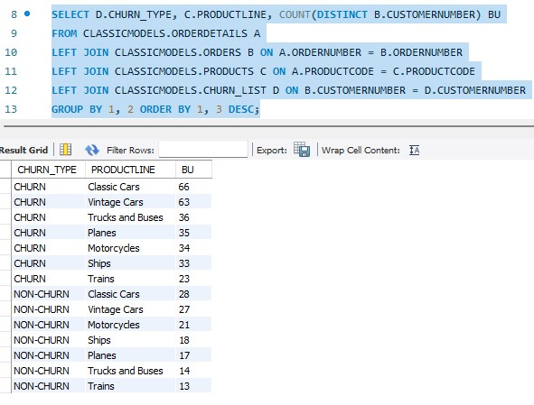
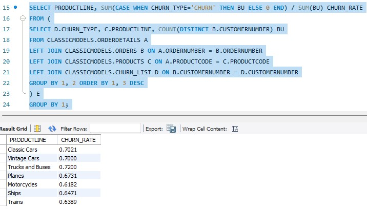

# 2023-06-29

## 확률과 통계

* 카이제곱분포
    * 표준정규분포의 제곱합
* t분포
    * 표준정규분포를 카이제곱분포로 나눈 값.
    * 표준정규분포에서 분산 값을 조절하기 위한 분포
* F분포
    * 두 표준정규분포 간의 비율 값.

 
 
## SQL
* Query
    * `DATEDIFF(date1, date2)`
        * date1 - date2 결과값 반환
* 용어
    * AMV
        * 인당 구매 금액
    * ATV
        * 1건의 거래 평균 매출 (Average Transaction Value)
    * Retention Rate
        * 전에 샀다 다음에도 구매를 한 구매자의 비율
    * Churn Rate
        * 비활동 고객으로 전환된 비율
* 연습

 

## Crawling

* `from bs4 import BeautifulSoup`
    * `soup.find_all("div", class_="_aagv")`
    * `item.find("img")['src']`
* `from selenium.webdriver.common.by import By`
    * `driver.find_element(By.NAME, "username")`
    * `driver.find_element(By.CSS_SELECTOR, "#loginForm > div > div:nth-child(3)")`
    * `.click()`
        * rect 영역을 얻어 해당 영역을 클릭한다.
    * `driver.close()`
        * 탭 닫기
    * `driver.quit()`
        * 브라우저 닫기
* `from xml.etree import ElementTree`
    * `ElementTree.fromstring(text)`
    * `item.find('death').text`
* json, requests
    * `requests.post(url, data={"sido_cd": sido_cd})`
    * `resp.json()["list"]`
    * `json.dumps(result_dict, ensure_ascii=False)`